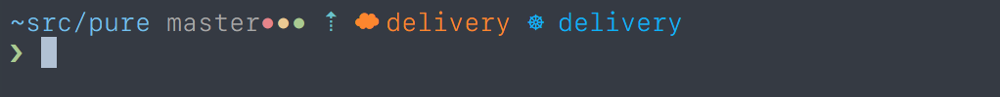

# Pure

> Pretty, minimal and fast ZSH prompt (Lyra edition)

This is my fork of [the pure prompt](https://github.com/sindresorhus/pure) for zsh, with these changes:

- More detailed git status: a red dot for untracked files, a yellow dot for unstaged changes, a green dot for staged changes (ready to be committed)
- The current `$AWS_PROFILE` is added to the prompt
- The current Kuberenetes context is added to the prompt

For all other information, please consult the upstream readme.
